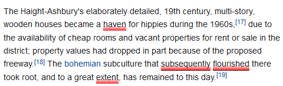
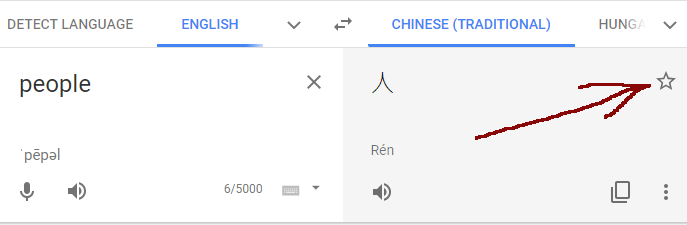
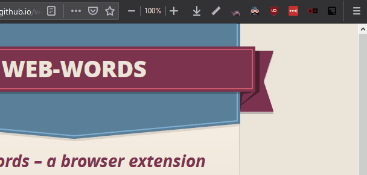

# _Web Words_ – a browser extension

Show translated words on a tooltip on webpages with _[Google Translate](https://translate.google.com/)_ saved phrases.

## Features

- Auto-import your entire saved dictionary from _Google Translate_ with a single click.
- Newly starred words automatically imported and open pages are getting updated. Works well alongside other [translate add-on](https://addons.mozilla.org/en-US/firefox/addon/to-google-translate/)s.

Are you missing something? Visit the _GitHub_ [projects page](https://github.com/SubZtep/web-words/projects) for roadmap(ish) and feel free to get involved.

## How It Works?

If you logged in with your _Google_ account, you are able to save translations with the star icon.

After a while you'll have too many words and there is a possibility of memorizing them permanently immediately isn't on the _skills palette_ at the moment. The target audience.

> (-(-\_(-\_-)\_-)-)

**(-(–\_(—\_—)\_–)-)**

(—(‒\_(-_-)\_‒)—)

This plugin manages to access this word list. **When you open a webpage, [detect](https://developer.mozilla.org/en-US/docs/Mozilla/Add-ons/WebExtensions/API/tabs/detectLanguage) the language and search for word matches with your dictionary.** If successful, translate them and display on a popup on mouse hover.

At least try, the plugin is beta and under development. You are more than welcome to [report any issue](https://github.com/SubZtep/web-words/issues) and contribute.

Don't forget to run the local dictionary update regularly, which is happening once automatically after plugin installation. Click the icon on the _browser action bar_ and press the button.

Another purpose of this icon is to show the number of translated words on the current page.

## How To Install

### From source

Clone the project locally and build with _NodeJS_ or simply [download](https://github.com/SubZtep/web-words/releases) and unpack zip from releases. Add `dist/manifest.json` in the browser menu somewhere to add-ons in dev mode.

### One-clicker

Available at **_Firefox_** [add-ons](https://addons.mozilla.org/addon/web-words/) and **_Chrome_** [web store](https://chrome.google.com/webstore/detail/web-words/oafbnidobflmgdldmjjdiofefhofknbm).

## Your Data

Your data never leaves your browser. This plugin simply opens the Google Translate page and copy your starred words into your [local storage](https://developer.mozilla.org/en-US/docs/Mozilla/Add-ons/WebExtensions/API/storage), there is
no custom server call involved.

## FAQ

### Why?

Started for personal use. (⁄ ⁄•⁄ω⁄•⁄ ⁄)

### Supported Languages

All of them. It's up to the user's dictionary which languages are translate from.

The interface is english only atm but translatable easily.

---

🔗 [./fun.md](./fun.md) ٩(◕‿◕｡)۶

---
