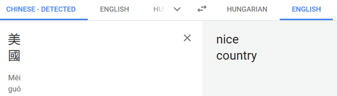
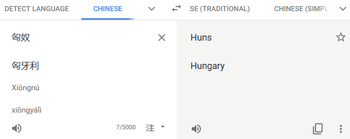

# _Web Words_ – a browser extension

Show translated words on a tooltip on webpages with _[Google Translate](https://translate.google.com/)_ saved phrases.

## How It Works?

If you logged in with your _Google_ account, you are able to save translations with the star icon. After a while you'll get too many words and for some people memorizing permanent them immediately isn't on the _skills list_. They are the target audience.

This plugin manages to access to this list. When you open a webpage, it tries to [detect its language](https://developer.mozilla.org/en-US/docs/Mozilla/Add-ons/WebExtensions/API/tabs/detectLanguage). If success and found word(s) from the dictionary translate them. At least try, the plugin is **beta** and you are more than welcome to [report any issue](https://github.com/SubZtep/web-words/issues).

## Supported Languages

All of them. It's up to the user dictionary which language(s) translate from.

## Your Data

Your data never leaves your browser. This plugin simply opens the Google Translate
page and copy your starred words into your [browser local storage](https://developer.mozilla.org/en-US/docs/Mozilla/Add-ons/WebExtensions/API/storage), there is
no custom server call involved.

## Fun With Google Translate

Can be a coincidence in characters how people see

or how changed the view of a country.

